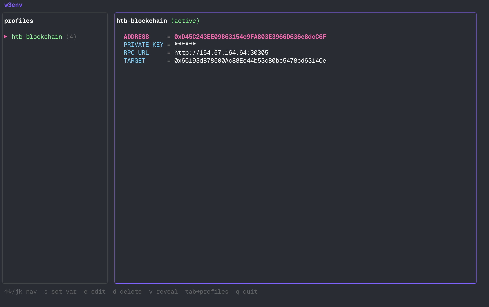

# w3env


Tired of re-exporting `RPC_URL`, `TARGET`, `PRIVATE_KEY` every time you open a new terminal during a CTF or pentest? w3env lets you save those as named profiles and switch between them instantly.

Think of it like `pyenv` or `nvm`, but for Web3 environment variables.

## Install

```bash
git clone https://github.com/hunntr/w3env
cd w3env
go build -o w3env .
sudo mv w3env /usr/local/bin/
```

Then set up shell integration (one time):

```bash
w3env install
source ~/.zshrc   # or ~/.bashrc
```

That's it. Every new terminal loads the integration automatically.

## Interactive TUI

Run `w3env` with no arguments to open the interactive interface:

```
w3env
```



| Key | Profiles panel | Vars panel |
|-----|---------------|------------|
| `↑↓` / `jk` | navigate | navigate |
| `enter` | activate profile | - |
| `n` | new profile | - |
| `r` | rename | - |
| `s` | add variable | add variable |
| `e` | - | edit value |
| `d` | delete profile | delete variable |
| `v` | - | toggle reveal |
| `tab` | -> vars panel | -> profiles panel |
| `q` | quit | quit |

Activating a profile in the TUI exports its variables to your shell automatically (same as `w3env use`).

## CLI

```bash
# Create a profile
w3env new htb-blockchain

# Activate it - exports all its vars to the current shell
w3env use htb-blockchain

# Set variables
w3env set RPC_URL     http://94.237.x.x:12345
w3env set TARGET      0xDeAdBeEf...
w3env set PRIVATE_KEY 0x1234...
w3env set CHAIN_ID    31337

# Also works with KEY=value syntax
w3env set RPC_URL=http://94.237.x.x:12345

# Show all vars (sensitive keys masked by default)
w3env show
w3env show --reveal
# Read a single value - useful in one-liners
cast call $(w3env get TARGET) "isSolved()(bool)"

# Run a command with profile vars injected into the subprocess
w3env run forge script script/Exploit.s.sol --broadcast

# Deactivate - unsets all vars in the current shell
w3env deactivate
```

```bash
# List all profiles
w3env list

# Show vars of a specific profile (without switching)
w3env show htb-blockchain-2

# Copy a profile as a starting point
w3env copy htb-blockchain htb-blockchain-2

# Rename / delete
w3env rename htb-blockchain-2 old-htb
w3env delete old-htb

# Remove a single variable from the active profile
w3env unset CHAIN_ID

# Print which profile is active
w3env which

# Print export commands (for scripts)
w3env export
```

## Prompt

Once the shell integration is installed, the active profile shows up in your prompt automatically:

```
[htb-blockchain] user@host ~ $
```

## Foundry tip

Name your vars `ETH_RPC_URL` and `ETH_FROM` and cast/forge pick them up without extra flags:

```bash
w3env set ETH_RPC_URL http://rpc.target:8545
w3env set ETH_FROM    0xYourAddress

cast send $TARGET "attack()"
```

## Data

Profiles are stored in `~/.config/w3env/state.json` (`chmod 600`). Nothing is sent anywhere.

To uninstall the shell integration:

```bash
w3env uninstall
```

## License

[GPL v3](LICENSE)

## Support

If w3env saves you time on a CTF or pentest, consider dropping a star on the repo - it helps a lot.